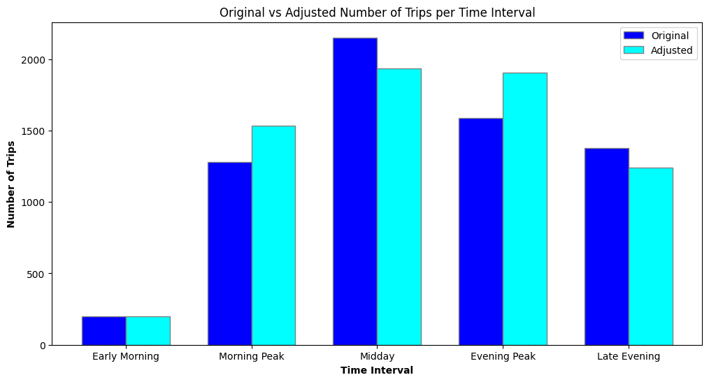

# Metro Operations Optimization

Aims at improving the efficiency of metro train scheduling. By minimizing average waiting time and optimizing train frequency, the system ensures better resource allocation and enhanced passenger satisfaction.

---

## Project Objectives

- Optimize metro train frequency and scheduling.
- Minimize average passenger waiting time.
- Improve overall transit system efficiency using Python and mathematical modeling.

---

## Methodology

- **Data Simulation**: Synthetic data for station entries and exits over time.
- **Optimization Logic**: Linear programming and time-based scheduling algorithms.
- **Python Libraries Used**: `pandas`, `matplotlib`, `numpy`, and optimization modules.

---

## Key Features

- Visualizes passenger flow across different hours.
- Determines optimal number of trains required at different time intervals.
- Reduces operational cost by avoiding under- or over-scheduling.

---

## Sample Output

- Hourly passenger load graph.
- Optimal frequency decision table.
- Reduced average wait time metrics.

---

## Technologies Used

- Python 3.x
- Pandas
- NumPy
- Matplotlib
- SciPy (optional for optimization)

---

## Installation

1. Clone the repository
```bash
git clone https://github.com/veydantkatyal/metro-operations-optimisation.git
cd metro-operations-optimisation
```
2. Install Dependencies
```bash
pip install -r requirements.txt
```
3. Run the jupyter/colab notebook
- Go through the analysis presented in the colab notebook for complete intuitive approach to this problem.
```bash
jupyter metro_optimization.ipynb
```
---

## License
This project is licensed under [MIT License](https://github.com/veydantkatyal/metro-optimisation/blob/main/LICENSE)
